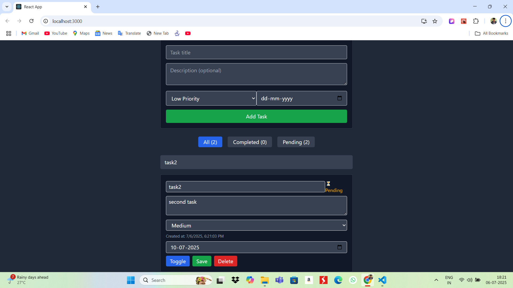

# Personal Task Tracker 

---

##  Description

A simple task management app built with React and Tailwind CSS. Users can log in using just a username, add/edit/delete tasks, mark them as complete, and filter or search through tasks. All task data is saved using localStorage. The app also includes a dark mode toggle.

---

##  Features

- Login with username (no password)
- Add tasks with:
  - Title
  - Description (optional)
  - Priority (Low / Medium / High)
  - Due Date 
- Edit or delete tasks
- Mark tasks as completed or uncompleted
- Filter tasks (All / Completed / Pending)
- Search tasks by title
- Dark mode toggle (remembers your choice)
- All data saved locally using localStorage

---

## 🛠️ Setup Instructions

1. Clone the repository

    ```
    git clone https://github.com/your-username/task-tracker.git
    ```

2. Open the project folder

    ```
    cd task-tracker
    ```

3. Install dependencies

    ```
    npm install
    ```

4. Start the development server

    ```
    npm start
    ```

5. Open in your browser

    ```
    http://localhost:3000
    ```


---

##  Technologies Used

- React.js
- Tailwind CSS
- JavaScript
- LocalStorage

---

##  Live Demo

[Click here to try it out]()

---

##  Screenshots

###  Dashboard (Light Mode)


###  Dashboard (Dark Mode)


### Task Edit Inline


### Task Search



##  Author

Built by **Suman Sinha** as part of an internship assignment.
